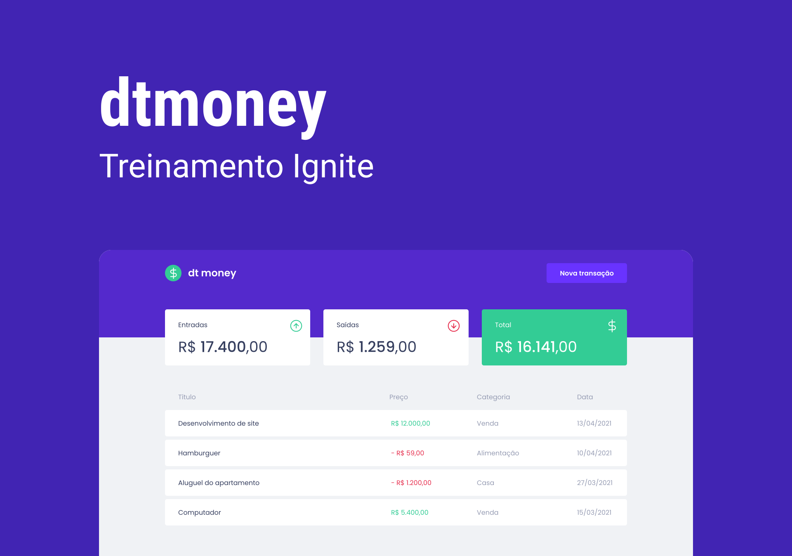

  

# 📖 About

**dtmoney** is a web application used to manage finances.

Project developed during [Rocketseat's](https://www.rocketseat.com.br/) Ignite course, React trail.

# 💻 Site

Access the [application](https://dtmoney-peach.vercel.app/) and take a look.

# 🎨 Design

The application design is available on [**Figma**](https://www.figma.com/), if you are interested, click [**here**](https://www.figma.com/file/Ij6aRZLbMNMmgWXRaqlqZl/dtmoney-Ignite).

# 🔩 Technologies

- [React](https://react.dev/)
- [Create React App](https://create-react-app.dev/)
- [Styled Components](https://styled-components.com/)
- [MirageJS](https://miragejs.com/)
- [TypeScript](https://www.typescriptlang.org/)
